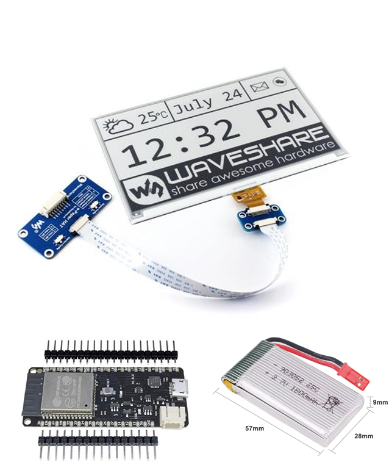
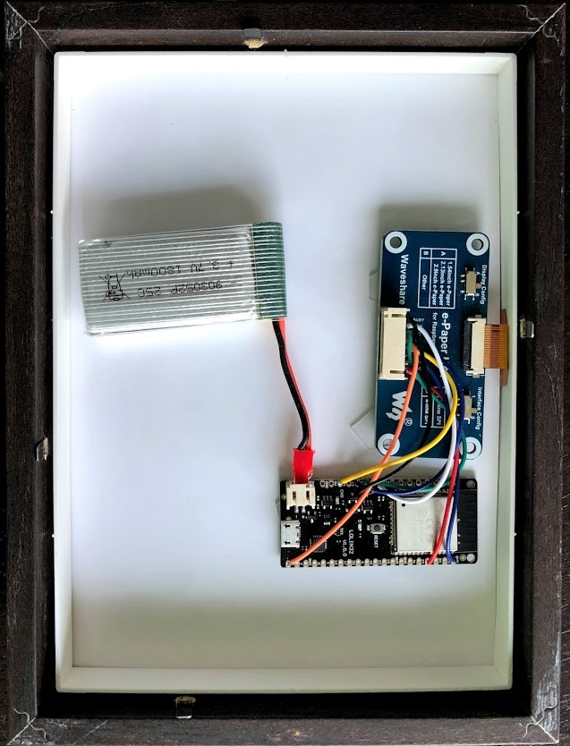

# eink-family-calendar-esp32
E-ink calendar integrating google calendar og OWM onto a 7.5 inch Waveshare screen based on an ESP32 LOLIN32 board

|||

For many years I have been playing with the idea of breaking the barrier between physical and digital calendars - more specifically creating a nice looking e-ink calendar that can hang in our living room/kitchen. Now the idea has materialized in a very satisfying way, and I would love to share how I made it come true.

The calendar displays the first 9 events for all selected google calendars for a specific user. In my case I have selected that of my wife, myself and our shared family calendar. Besides the calendar, I have created a mini-weather display in the corner, showing an icon from OpenWeather Maps, as well as temperature and windspeed.

The project combine a 7.5 Waveshare e-ink screen, with an ESP32 microcontroller and a LIPO battery. It is packaged in 13x18 IKEA Ribba frame. Besides Arduino code for the microcontroller, I also had to create a google script to extract the calendar entries from google.

Credits to the ESP32 E-Ink Weather Station project on Github, from which I have learned a lot when coding the project.

Components:
* Waveshare 7.5 inch E-ink Screen (800x600 version) ~76 EUR on Amazon.de (linked to the yellow C version, as I could not find the red anymore)
* LOLIN32 ESP32 ~8-9 USD on Aliexpress (I used an older version, but get the D32 or D32 Pro as it has integrated battery gauge on pin 35)
* LIPO battery with 1800 mAH ~13 EUR on Amazon.de
* IKEA Ribba 13x18 frame ~3 EUR in IKEA

Total cost: ~100 EUR

|||

Pin-setup:

|Waveshare 7.5|LOLIN32 | 
|----------|----------|
|Vcc | 3V | 
|GND | GND | 
|DIN | 14 | 
|CLK | 13 | 
|CS | 15 | 
|DC | 27 | 
|RST | 26 | 
|BUSY | 25| 

Make sure to adjust the configuration.h file with both a link to your google webapp (that fetches the calendar entries) and with your location and API key for open weather maps.

For further guidance see my instructable on the project: 
https://www.instructables.com/id/E-Ink-Family-Calendar-Using-ESP32/
